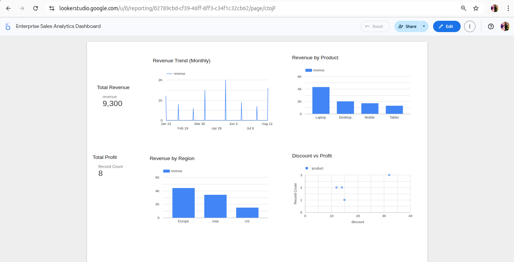
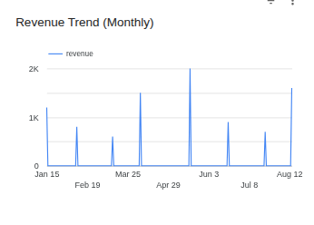
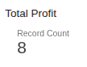
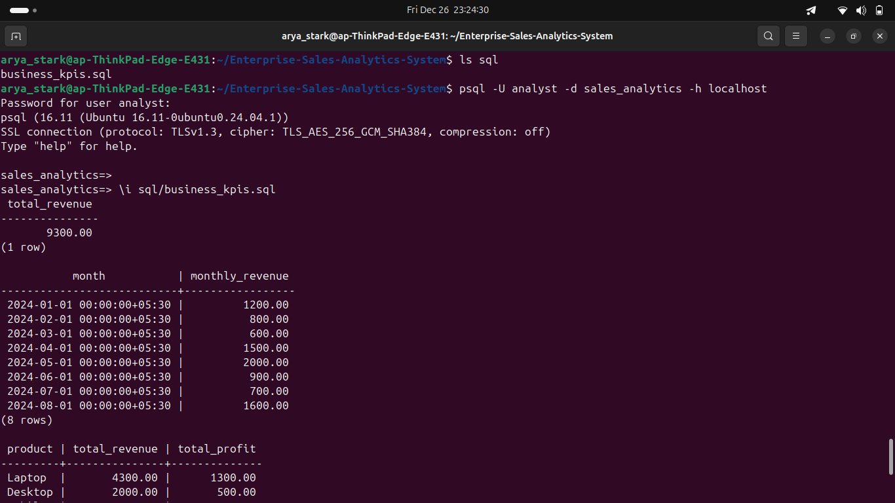

# 📊 Enterprise Sales Analytics Dashboard

## 🚀 Project Overview
This project is an end-to-end Enterprise Sales Analytics system designed to analyze sales performance using real business data stored in PostgreSQL and visualized using modern BI tools.

The dashboard helps stakeholders track revenue, profit, product performance, regional trends, and discount impact for better decision-making.

---

## 🎯 Business Objectives
- Monitor overall sales revenue and profit
- Analyze monthly revenue trends
- Identify top-performing products
- Compare regional sales performance
- Understand discount vs profit relationship

---

## 🛠 Tools & Technologies
- PostgreSQL (Database)
- SQL (Data querying)
- Google Looker Studio (Dashboard & Visualization)
- Google Sheets (Data Source)
- CSV Export from PostgreSQL
- Git & GitHub (Version control)

---

## 📈 Key Metrics
- Total Revenue
- Total Profit
- Revenue Trend (Monthly)
- Revenue by Product
- Revenue by Region
- Discount vs Profit

---

## 📊 Dashboard Components
- KPI Scorecards
- Time Series Charts
- Bar Charts
- Scatter Plot Analysis

---

## 🔗 Live Dashboard
👉 https://lookerstudio.google.com/reporting/02789cbd-cf39-46ff-8ff3-c34f1c32cb62

---

## 📸 Dashboard Screenshots

### Dashboard Overview

### Revenue Analysis

### Profit & Discount Analysis

### Sql Analysis Results

---

## 📁 Project Structure

Enterprise-Sales-Analytics-System/
│
├── README.md
├── data/
│ └── sales_data.csv
├── dashboards/
├── excel/
├── screenshots/
│ ├── dashboard_overview.png
│ ├── revenue_analysis.png
│ └── profit_analysis.png
├── sql/

---

## 💡 Why This Project Matters
This project demonstrates real-world data analytics skills including:
- Database querying
- Data extraction & transformation
- Business KPI analysis
- Executive dashboard creation
- End-to-end analytics workflow

---

👩‍💻 Author

Aishwarya Priydarshni
🎓 Final-Year B.Tech CSE (Data Science) Student
🧠 Aspiring Data Scientist with interests in Python, machine learning, and data visualization
📊 Passionate about transforming data into insights and impact
